### Software Engineer · Distributed Systems · AI Systems

Building scalable distributed systems, backend infrastructure, and retrieval-augmented AI applications from first principles.

`Go` `Python` `TypeScript` `PostgreSQL` `Redis` `Docker` `Kubernetes`

---

## 👋 About Me

I'm a Computer Science student at **LNMIIT** who enjoys building systems from the ground up.

Most of my work revolves around backend engineering, distributed systems, and applied AI. I enjoy understanding how things work internally — whether that's implementing database protocols, designing scalable microservices, or building retrieval systems with LLMs.

**Recently I've been exploring:**

- Distributed systems & consensus (Raft, Paxos)
- High-performance backend engineering
- Retrieval-Augmented Generation (RAG)
- Multi-agent AI systems
- Systems programming in Go and Rust

---

## 📌 Featured Projects

<table>
<tr>
<td width="50%" valign="top">

### 🧠 SAGE
**Self-Adaptive Generative Engine**

Production-grade RAG system with document ingestion, recursive chunking, and self-evaluation architecture.

- ✓ End-to-end PDF document ingestion & text extraction pipeline
- ✓ Recursive text chunking optimized for context retention
- ✓ Modular backend service built with FastAPI & Python
- ✓ Vector storage design for Qdrant & BGE embeddings
- ✓ Architectural pipeline for self-reflective retrieval loops

`Python` `FastAPI` `LangGraph` `LangChain` `Qdrant` `Docker`

[Learn More →](https://github.com/Prabhav200511)

</td>
<td width="50%" valign="top">

### ⚡ MyCache
**High-performance in-memory datastore built from scratch in Go**

Custom implementation of a Redis-compatible key-value store over raw TCP sockets.

- ✓ Custom RESP (Redis Serialization Protocol) parser
- ✓ Concurrent storage engine with mutex thread safety
- ✓ Custom TCP networking layer built over raw sockets
- ✓ Append-Only File (AOF) durability & persistence engine
- ✓ Memory-efficient key-value storage design

`Go` `TCP` `RESP Protocol` `Concurrency` `AOF Persistence`

[Learn More →](https://github.com/Prabhav200511)

</td>
</tr>
<tr>
<td width="50%" valign="top">

### 💬 Chatty
**Real-time full-stack messaging platform**

Responsive, low-latency chat application powered by WebSockets with persistent conversation history.

- ✓ Bidirectional real-time communication via Socket.IO
- ✓ Secure user authentication & authorization using JWT
- ✓ Persistent chat history & message storage in MongoDB
- ✓ Modular REST API layer built with Node.js & Express
- ✓ Responsive single-page interface built with React.js

`React.js` `Node.js` `Express` `Socket.IO` `MongoDB` `JWT`

[Learn More →](https://github.com/Prabhav200511)

</td>
<td width="50%" valign="top">

### 🎟️ QuickTicket
**Full-stack event reservation & QR validation platform**

Secure ticketing architecture with role-based access, capacity tracking, and one-time QR validation.

- ✓ Cryptographically unique QR-coded ticket generation
- ✓ One-time ticket validation & scanning to prevent overselling
- ✓ Secure role-based access (`Host` vs `Customer`) with HTTP-only JWT
- ✓ OTP-based email verification & password recovery workflow
- ✓ Relational data modeling & capacity tracking with PostgreSQL (AWS RDS)

`React` `Node.js` `Express` `PostgreSQL` `AWS RDS` `JWT`

[Learn More →](https://github.com/Prabhav200511)

</td>
</tr>
</table>

| Project | Engineering Focus |
|---|---|
| 🧠 **SAGE** | GenAI · LLM Engineering · RAG Architecture |
| ⚡ **MyCache** | Systems Programming · Protocol Design · Concurrency |
| 💬 **Chatty** | Full-Stack Engineering · Real-Time WebSockets |
| 🎟️ **QuickTicket** | Backend Architecture · Role-Based Access · Security |

---

## 🛠️ Skills

<table>
<tr>
<td valign="top" width="25%">

**Languages**

Go · Python · TypeScript · Rust · C++

</td>
<td valign="top" width="25%">

**Backend**

Node.js · Express · FastAPI · Redis · PostgreSQL · Kafka

</td>
<td valign="top" width="25%">

**Cloud & Infra**

Docker · Kubernetes · AWS · GitHub Actions

</td>
<td valign="top" width="25%">

**AI & ML**

PyTorch · LangChain · LangGraph · Qdrant · ONNX Runtime

</td>
</tr>
</table>

---

## 📊 GitHub Stats

  
  

---

## 🚀 Currently Working On

- Developing **SAGE** — self-correcting RAG framework with recursive chunking & Qdrant integration
- Building **MyCache** — Redis-compatible in-memory datastore built from scratch in Go
- Enhancing **Chatty** — real-time messaging platform with Socket.IO & MongoDB persistence
- Expanding **QuickTicket** — full-stack event reservation & secure QR validation platform
- Studying distributed systems & solving algorithmic problems on LeetCode

---

## ⚡ Engineering Principles

- Measure before optimizing.
- Prefer simple systems over clever ones.
- Reliability is a feature.
- Build from first principles.

---

*Let's connect and build something together.*

[GitHub](https://github.com/Prabhav200511) · [LinkedIn](https://linkedin.com) · [Email](mailto:contact@example.com)

